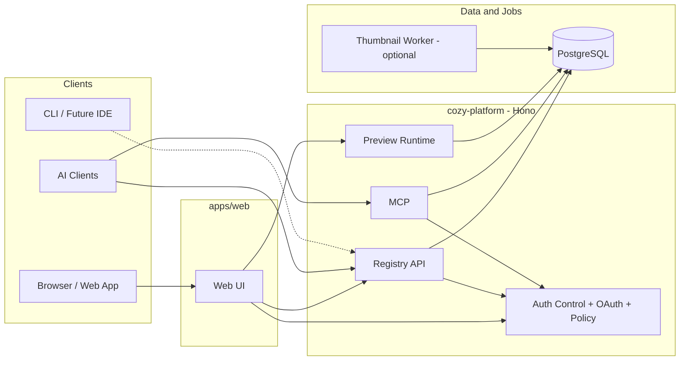
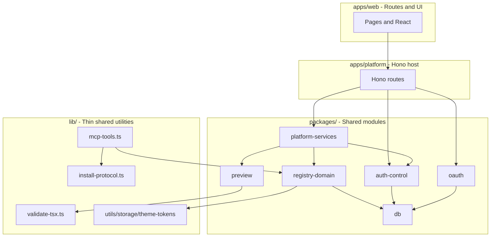
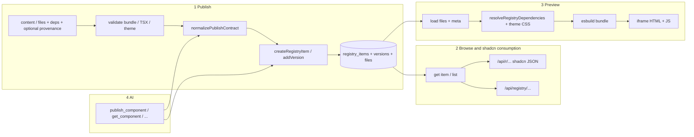
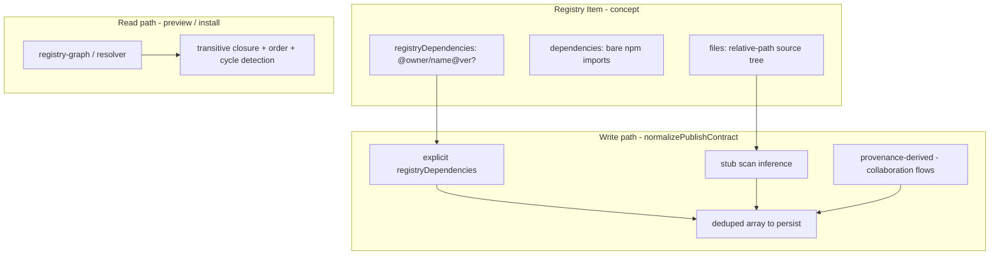
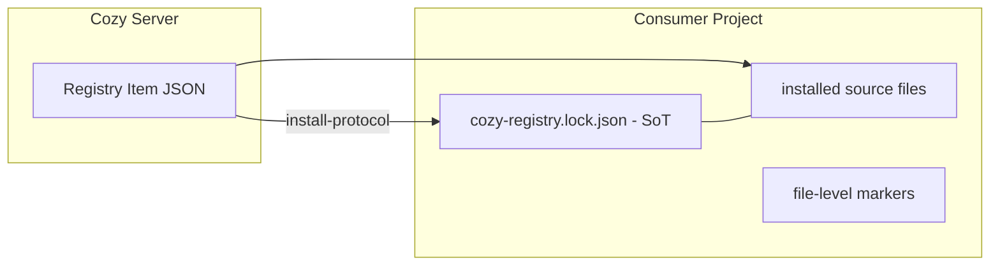

Status: active
Owner: engineering
Last updated: 2026-03-28
Source of truth: yes

# 系统架构与数据流

本文用图表归纳 **Cozy Registry** 当前的架构与实现分层；文字版模块说明见 [System Overview](./system-overview.md)。

## 1. 系统定位

**Cozy Registry** 现在采用 **两层运行时**：`apps/web` 负责 Web 界面与路由；`cozy-platform` 负责 Registry API、auth-control、OAuth、MCP、preview 和 policy。持久化使用 **PostgreSQL（Drizzle）**。资产形态为**源码 bundle**，而非向消费方分发 npm 编译产物。

## 2. 逻辑模块

## 3. 分层与依赖方向

要点：业务与领域规则优先集中在 `packages/*`；`apps/platform` 负责 HTTP / OAuth / MCP / auth-control 宿主；`apps/web` 负责 UI；`lib/` 只保留更薄的共享工具层。

## 4. Registry 核心数据流

## 5. 依赖模型（概念与实现落点）

## 6. 项目侧安装协议（与服务端 Registry 并列）

Registry 条目格式保持 shadcn 兼容；项目内安装状态由 Cozy 自定义的 lockfile 约束。详见 [Install Protocol](../20-engineering/install-protocol.md)。

## 7. 横切能力

| 能力 | 作用 |
|------|------|
| Auth（会话、OAuth、API Key） | 写操作与私有资源访问 |
| Policy / scope | API Key 与 MCP 的集合、owner 等范围 |
| Collections | 用户侧分组 |
| Thumbnail jobs | 异步生成列表缩略图 |

## 8. 设计要点归纳

- **单应用、多入口**：人（Web）、工具（`/api/r`）、AI（MCP）共用同一套 domain 与数据库。
- **源码为中心**：校验与预览围绕多文件 bundle 与两类依赖（npm / registry）展开。
- **发布契约集中**：`normalizePublishContract` 统一创建与发版时 `registryDependencies`、provenance、stub 的语义。
- **消费侧双协议**：对外 shadcn JSON；对内项目 [Install Protocol](../20-engineering/install-protocol.md) 与 lockfile。

## Related

- [System Overview](./system-overview.md)
- [Registry Dependency Management Spec](../20-engineering/registry-dependency-management-spec.md)
- [Install Protocol](../20-engineering/install-protocol.md)
- [API / Service Extraction Spec](../20-engineering/api-service-extraction-spec.md)
- [Repository Structure Guidelines](../20-engineering/repo-structure-guidelines.md)
