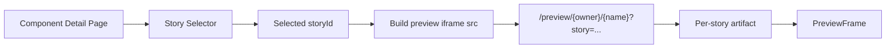

Status: proposed
Owner: engineering
Last updated: 2026-04-05
Source of truth: yes

# Multi-Story Preview Page Spec

本文定义 Cozy Registry 在**不引入 `stories.html`** 的前提下，如何在**同一个页面里切换多个 story preview**。

目标是先以最小改动实现：

- 同一组件可浏览多个 story
- 每个 story 继续复用现有 per-story artifact
- UI 在一个页面里切换 story
- 不改变当前 artifact key / story artifact 主模型

一句话：

- **MVP = 一个页面里的 story switcher + 每个 story 一个独立 `story.html` artifact**

## 1. Problem Statement

当前 preview 系统已经具备：

- per-story artifact
- `storyId` 参与 artifact key
- default story / warm preview targets
- preview route 支持 `story` 参数

但当前用户体验仍然偏：

- “打开一个 story”

而不是：

- “在一个页面里浏览组件的多个 stories”

这意味着：

- 用户需要通过外部链接或手动改 URL 来切换 story
- 组件详情页还没有真正成为 story browser
- 多 story 组件的可发现性和浏览效率不足

## 2. Goals

- 在组件详情页支持多 story 切换
- 继续复用现有 per-story artifact 模型
- 让 story 切换主要表现为切换 iframe `src`
- 支持默认 story、URL 同步、分享链接
- 保持实现简单，为未来 `stories.html` 方案预留空间

## 3. Non-Goals

以下不属于本阶段：

- 引入组件级 `stories.html` artifact
- 一个 HTML 中同时渲染所有 stories
- 同页共享 story runtime 状态
- 大规模 iframe keep-alive 缓存池
- 重写 preview artifact pipeline

## 4. Core Product Decision

本阶段明确采用：

- **一个页面里切换不同 `story.html`**

而不是：

- 构建一个新的组件级 `stories.html`

也就是说：

- 每个 story 仍然是独立 artifact 单位
- 页面层负责 story list 与 story 选择
- preview route 继续负责 per-story artifact 入口

## 5. Existing Foundations

当前系统已经具备以下基础能力：

- story 元数据与默认 story 选择
  - [preview-stories.ts](/Users/chenchen/Documents/GitHub/my-app/lib/preview-stories.ts)
- per-story preview artifact 构建与 warm targets
  - [preview-artifact-jobs.ts](/Users/chenchen/Documents/GitHub/my-app/lib/preview-artifact-jobs.ts)
- preview route 支持 `story` 参数
  - [route.ts](/Users/chenchen/Documents/GitHub/my-app/app/preview/[owner]/[name]/route.ts)
- 组件详情页已有 preview 容器
  - [ComponentDetail.tsx](/Users/chenchen/Documents/GitHub/my-app/app/registry/[owner]/[name]/ComponentDetail.tsx)
- 现有 iframe 组件
  - [PreviewFrame.tsx](/Users/chenchen/Documents/GitHub/my-app/app/components/PreviewFrame.tsx)

因此本阶段不需要修改：

- artifact key 模型
- preview route 的 story 参数 contract
- warm preview artifact targets 的整体策略

## 6. Target UX

目标体验：

1. 用户打开组件详情页
2. 页面显示该组件可用的 story 列表
3. 默认选中 default story
4. 点击其他 story 时，页面内 preview 区域切换到对应 story
5. URL 可反映当前选中 story，刷新后保持一致

用户感知：

- 像一个组件详情页内的 story tabs / story list
- 而不是跳转到完全不同的页面

## 7. URL Contract

### 7.1 Preview iframe URL

每个 story preview 继续使用现有 per-story preview route。

推荐 URL 形式：

```text
/preview/{owner}/{name}?project={projectKey}&v={version}&story={storyId}
```

补充说明：

- 这只是当前兼容路径示例
- 长期 canonical identity 应遵循 `owner + project + name`
- 也就是说，长期主路径应与 project-scoped identity 对齐
- 文档中的 `owner/name + ?project=` 仅用于兼容现有路由和渐进迁移，不应被理解为最终正式 ref 形态

规则：

- `project`：仅在 project-scoped item 时携带
- `v`：组件详情页当前版本
- `story`：当前选中 story id

### 7.2 Component page URL

组件详情页也应同步当前 story，例如：

```text
/registry/{owner}/{name}?story={storyId}
```

如需 project/version，也继续沿用现有页面参数规则。

同样地：

- 以上 URL 形式是当前兼容示例
- 长期页面身份也应收敛到 project-scoped identity

这样可以支持：

- 刷新后恢复当前 story
- story 级分享
- 从外部直接 deep link 到某个 story

## 8. Default Story Rules

页面初始化时，story 选择顺序如下：

1. 优先使用 URL query 中的 `story`
2. 否则使用 `getPreviewDefaultStoryIdFromMeta(...)`
3. 否则使用第一条可用 story
4. 若无 stories，则退回原有单 preview 逻辑

结论：

- query 是 source of truth
- meta 提供默认值
- UI 只在两者都缺失时兜底

进一步决议：

- 页面 query 中的 `story` 是页面状态的唯一 source of truth
- iframe URL 中的 `story` 仅由页面状态派生
- 不做 iframe 反向改写页面 story state

这样可以避免：

- detail page
- component card
- collections panel

各自维护不同的 story 状态机

## 9. UI Structure

### 9.1 Story selector placement

第一阶段建议直接放在组件详情页 preview 区上方。

推荐形式：

- tabs
- segmented control
- side list

根据现有布局，优先选择实现成本最低的一种。

### 9.2 Preview area

preview area 继续使用现有 [PreviewFrame.tsx](/Users/chenchen/Documents/GitHub/my-app/app/components/PreviewFrame.tsx)。

区别只是：

- `src` 改为由当前 `storyId` 驱动

### 9.3 Empty state

若组件没有定义 stories：

- 隐藏 story switcher
- 保持当前单 preview 体验

## 10. PreviewFrame Behavior

`PreviewFrame` 本阶段不需要理解完整 story 模型，只需要支持更平滑的 `src` 切换。

推荐行为：

- 切换 story 时保留当前 iframe 直到新 iframe `load`
- 新 iframe ready 后再切前景
- 减少白屏与闪烁

不建议本阶段做：

- 多 story iframe 常驻缓存池
- 无限 keep-alive
- 复杂的跨 story 生命周期管理

## 11. Data Flow



## 12. Implementation Plan

### Phase 1: Story selector in component detail page

目标：

- 组件详情页可列出 stories
- 用户可切换当前 story

任务：

- 从 item meta 读取 stories
- 渲染 story selector
- 维护当前选中 `storyId`

主要文件：

- [ComponentDetail.tsx](/Users/chenchen/Documents/GitHub/my-app/app/registry/[owner]/[name]/ComponentDetail.tsx)
- [preview-stories.ts](/Users/chenchen/Documents/GitHub/my-app/lib/preview-stories.ts)

验收：

- 多 story 组件在详情页可见 story list
- 点击后能切换当前 story

### Phase 2: Preview URL generation and iframe switching

目标：

- story 选择能切换到正确 iframe URL

任务：

- 根据 `owner / project / version / storyId` 生成 preview URL
- 将该 URL 传给 `PreviewFrame`

主要文件：

- [ComponentDetail.tsx](/Users/chenchen/Documents/GitHub/my-app/app/registry/[owner]/[name]/ComponentDetail.tsx)
- [PreviewFrame.tsx](/Users/chenchen/Documents/GitHub/my-app/app/components/PreviewFrame.tsx)

验收：

- 不同 story 命中各自 artifact
- story 切换时不跳离页面

补充语义：

- 这里的 artifact hit 同时包括：
  - `artifactStatus = ready + artifactCapability = managed-artifact`
  - `artifactStatus = ready + artifactCapability = compatible-artifact`
- 不能把 compatible mode 误判成“未命中 artifact”

### Phase 3: URL synchronization

目标：

- 当前 story 可通过 URL 恢复

任务：

- 读取 query 中的 `story`
- 切换 story 时更新 URL

验收：

- 刷新后保持当前 story
- deep link 可直接打开指定 story

### Phase 4: Polish

目标：

- 降低 story 切换白屏和 remount 体感

任务：

- 优化 `PreviewFrame` 切换体验
- 可选加入 hover prefetch / warm status query

验收：

- story 切换明显更稳
- 不需要为此大幅增加页面复杂度

## 13. Suggested File Ownership

### Agent A: Story selection and page state

负责：

- [ComponentDetail.tsx](/Users/chenchen/Documents/GitHub/my-app/app/registry/[owner]/[name]/ComponentDetail.tsx)
- [preview-stories.ts](/Users/chenchen/Documents/GitHub/my-app/lib/preview-stories.ts)

### Agent B: PreviewFrame switching polish

负责：

- [PreviewFrame.tsx](/Users/chenchen/Documents/GitHub/my-app/app/components/PreviewFrame.tsx)

### Agent C: Optional expansion to card/dashboard contexts

负责：

- [ComponentCard.tsx](/Users/chenchen/Documents/GitHub/my-app/app/components/ComponentCard.tsx)
- [CollectionsPanel.tsx](/Users/chenchen/Documents/GitHub/my-app/app/(auth)/dashboard/CollectionsPanel.tsx)

## 14. Acceptance Criteria

- 多 story 组件可在同一详情页切换不同 story
- 切换时 iframe URL 正确带上 `story`
- 每个 story 继续命中自己的 artifact
- 刷新页面后当前 story 保留
- 没有 stories 的组件不受影响
- 不需要新增 `stories.html`

## Related

- [Story Preview UX / Performance Spec](./story-preview-ux-performance-spec.md)
- [Preview Artifact Capability Model Spec](./preview-artifact-capability-model-spec.md)
- [Preview Dependency Provider Refactor Spec](./preview-dependency-provider-refactor-spec.md)
