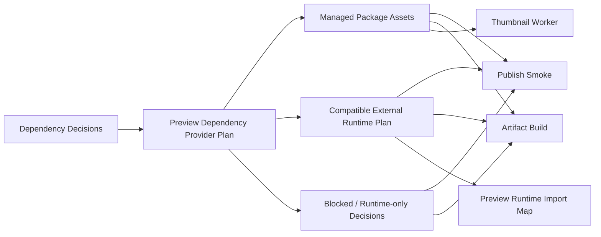

Status: proposed
Owner: engineering
Last updated: 2026-04-04
Source of truth: yes

# Preview Dependency Provider Refactor Spec

本文定义 preview 第三方依赖提供层的重构方案，重点解决当前实现中仍然依赖宿主 Web App `node_modules` 与 `next.config.ts` output tracing 的结构性耦合。

本文是以下两份文档的落地补充：

- [Preview Third-Party Dependency Governance Spec](./preview-third-party-dependency-governance-spec.md)
- [Preview Artifact Capability Model Spec](./preview-artifact-capability-model-spec.md)

核心目标不是“再补一层 tracing 规则”，而是让 preview dependency provider 真正成为：

- publish smoke 的唯一依赖来源边界
- preview artifact build 的唯一依赖来源边界
- runtime import map / compatible external plan 的唯一依赖来源边界

## 1. Problem Statement

最近的实现已经开始引入：

- `providerMode`
- `managed-provider`
- `compatible-external`
- `managed-artifact / compatible-artifact / runtime-only`

但当前生产路径仍然存在一个关键补丁式耦合：

- `next.config.ts` 会扫描宿主 app `package.json`
- 把“恰好已经安装的 trusted packages”加入 output tracing
- preview build / smoke 在部署环境中仍能通过宿主 app 的 traced `node_modules` 找到这些包

这条路径虽然能临时修复 Vercel 上的缺包问题，但会带来三个长期问题：

1. 平台正确性仍然由宿主 app 是否声明依赖决定
2. `managed-provider` 的 contract 仍然是假象，真实来源其实还是 host app
3. 一旦 provider cache / mirror 成为正式依赖来源，`next.config.ts` tracing 逻辑会变得误导且不完整

一句话：

当前系统已经有了 provider mode 的概念，但还没有完成 **provider-owned dependency assets** 的真正落地。

## 2. Goals

- 让 preview 依赖来源从宿主 app `node_modules` 解耦
- 让 `managed-provider` 真正拥有独立的 provider-owned 物理资产
- 让 `compatible-external` 真正拥有统一的 runtime loading plan
- 让 `compatible-artifact` 不再借用 `skipped` 语义，而是消费真实 artifact shell
- 最终移除 `next.config.ts` 对 preview trusted packages 的特殊 tracing 依赖

## 2.1 Official Boundary Decision

本 spec 明确拍板：

- provider 必须成为 preview dependency 的正式供应边界
- 平台长期不接受“宿主 app 安装了就算支持”
- host tracing / host fallback / host-copied trees 只属于过渡兼容层

因此：

- `managed-provider` 的可用性必须由 provider-owned assets 保证
- `compatible-external` 的可用性必须由 runtime plan / import map contract 保证
- 宿主 app 的 `package.json` 不应继续作为生产正确性的 source of truth

## 3. Non-Goals

以下能力不属于本阶段：

- 完整 npm registry 代理
- 对任意 npm 包的按需在线安装
- 私有 npm registry 凭据与企业仓库接入
- 在本阶段删除所有 host fallback

## 4. Current Patchy Design

### 4.1 Host-driven tracing

当前 [next.config.ts](/Users/chenchen/Documents/GitHub/my-app/next.config.ts) 会：

- 读取根 `package.json`
- 找出 trusted exact packages 和 trusted namespace 下已安装的包
- 将这些包的真实路径加入 `outputFileTracingIncludes`

这条路径的本质是：

- “只要宿主 app 安装了，preview 部署产物里就尽量把它带上”

这是一条有效的止血方案，但不是长期 provider contract。

### 4.2 Provider still falls back to host reality

当前 [preview-dependency-provider.ts](/Users/chenchen/Documents/GitHub/my-app/lib/preview-dependency-provider.ts) 仍主要做两件事：

- 优先读取临时 provider root
- 不存在时从宿主 app 的 `node_modules` 复制
- 再不行就 host fallback

这意味着：

- provider cache 不是 source of truth
- provider 只是在 host app 之上的一层复制缓存

### 4.3 Compatible capability is not fully realized

当前 `compatible-artifact` 已经作为 capability 概念存在，但 preview route 仍然主要通过 `artifactStatus === "skipped"` 进入兼容文案页面，而不是直接消费一个 `ready` 的 compatible artifact shell。

这意味着：

- capability model 在数据层开始成形
- 但运行时主路径仍停留在旧的 binary skip model

## 5. Target Architecture

长期目标是把 preview 依赖来源收敛到一个统一的 provider plan。



### 5.1 Core idea

provider 不再只回答：

- “这个包在 host 上能不能 resolve”

而要回答：

- 这个包的 provider mode 是什么
- 如果是 `managed-provider`，物理资产在哪里
- 如果是 `compatible-external`，runtime import map target 是什么
- 最终应进入哪种 artifact capability

## 6. Provider-Owned Asset Model

### 6.1 `managed-provider`

`managed-provider` 依赖必须由平台自己持有一份受控副本。

建议资产形式：

- provider cache 目录
- 预热镜像目录
- 或对象存储中的 unpacked dependency tree

关键要求：

- 这份副本不依赖宿主 app 是否声明该依赖
- smoke / artifact build / thumbnail worker 都从同一份 provider-owned 资产读取
- exact version 是必要条件

### 6.2 `compatible-external`

`compatible-external` 不要求物理 provider 副本。

它需要的是：

- 一份统一的 runtime loading plan
- 平台生成的 import map entry
- 可被 preview iframe 与 compatible artifact shell 消费的 external contract

关键要求：

- 不得继续靠“build 时 external 掉，运行时听天由命”
- import map target 必须来自平台 runtime contract
- compatible artifact 应允许 `ready`

### 6.3 `runtime-only`

`runtime-only` 仍然保留，但必须收敛为最后降级车道。

它不应继续承担：

- “不是 fully managed 就都来这里”

## 7. Required Runtime Contracts

### 7.1 Managed package contract

对 `managed-provider` 依赖，平台必须保证：

- publish smoke 可以稳定解析
- artifact build 可以稳定 bundle
- thumbnail worker 可加载
- 部署环境不依赖 host tracing 才能成功

### 7.2 Compatible external contract

对 `compatible-external` 依赖，平台必须保证：

- 可以生成 compatible artifact shell
- runtime import map plan 可生成
- preview iframe 能稳定加载 external 依赖
- warm cache / artifact cache 可正常工作

### 7.3 Failure contract

以下情况才应让 compatible path 失败：

- artifact shell 本身构建失败
- runtime import map plan 无法生成
- required external target 不可用
- thumbnail / preview runtime 无法安全加载

## 8. Why `next.config.ts` Tracing Must Be Removed From The Contract

当前 tracing 修复的主要问题不是“写得丑”，而是它把平台正确性绑定回了 host app。

### 8.1 Why it is patchy

- 依赖来源来自根 `package.json`
- 部署产物是否可构建取决于 web app 是否正好安装这些包
- provider mode 语义无法在部署边界上成立

### 8.2 What “better design” means

更优雅的设计不是写更聪明的 tracing glob，而是：

- host app tracing 只服务 host app 自己
- preview dependency assets 由 provider 自己声明和拥有
- 部署系统根据 provider 资产边界决定需要带什么，而不是从 `package.json` 反推

## 9. Phased Implementation

### Phase 1: Stop relying on tracing as the primary contract

目标：

- 保留现有 tracing 作为 compatibility fallback
- 但文档、代码注释、diagnostics 都明确它只是过渡方案

任务：

- 给 [next.config.ts](/Users/chenchen/Documents/GitHub/my-app/next.config.ts) 增加注释，明确其为 temporary host compatibility bridge
- 在 provider diagnostics 中标记 `hostFallbackUsed` / `hostTracingDependency`
- 所有 `managed-provider` 决策都输出来源诊断

验收：

- 不再把 host tracing 视为正式 provider 语义

### Phase 2: Build a real provider plan object

目标：

- 让 provider 返回统一的 dependency plan，而不只是 `nodePaths`

建议输出结构：

```ts
type PreviewDependencyPlan = {
  managedPackages: Array<{
    packageName: string;
    version: string;
    packageRoot: string;
    source: "provider-cache" | "host-fallback";
  }>;
  compatibleExternals: Array<{
    packageName: string;
    version: string | null;
    importMapTarget: string;
  }>;
  diagnostics: Array<{
    packageName: string;
    code: string;
    message: string;
  }>;
};
```

任务：

- 扩展 [preview-dependency-provider.ts](/Users/chenchen/Documents/GitHub/my-app/lib/preview-dependency-provider.ts)
- 让 smoke / artifact build / preview runtime 共用 `PreviewDependencyPlan`

验收：

- `compatible-external` 不再是 provider 中的“空分支”
- provider 成为真正的单一依赖边界

### Phase 3: Make `compatible-artifact` truly `ready`

目标：

- 让 compatible artifact 真正成为成功产物，而不是 `skipped` 文案分支

任务：

- 更新 [lib/preview-artifact-jobs.ts](/Users/chenchen/Documents/GitHub/my-app/lib/preview-artifact-jobs.ts)
- 让 compatible path 产出 artifact shell 与 runtime import map metadata
- 更新 [app/preview/[owner]/[name]/route.ts](/Users/chenchen/Documents/GitHub/my-app/app/preview/[owner]/[name]/route.ts)
- `artifactCapability = compatible-artifact` 时允许 `artifactStatus = ready`

验收：

- preview route 不再把 compatible path 挂在 `skipped`
- UI 可以直接消费 compatible artifact

### Phase 4: Move managed assets off host app tracing

目标：

- managed-provider 的部署资产由 provider 自己拥有

任务：

- 为 provider cache / mirror 设计部署资产布局
- worker / smoke / build 从 provider-owned root 读取
- 逐步删除 [next.config.ts](/Users/chenchen/Documents/GitHub/my-app/next.config.ts) 中 preview trusted package tracing 依赖

验收：

- Vercel / deploy 环境中，managed preview deps 是否可用不再取决于宿主 app 的 `package.json`

## 10. Recommended Agent Breakdown

### Agent A: Provider Plan Refactor

负责：

- [lib/preview-dependency-provider.ts](/Users/chenchen/Documents/GitHub/my-app/lib/preview-dependency-provider.ts)
- `PreviewDependencyPlan` 设计与实现
- diagnostics 整理

### Agent B: Compatible Artifact Runtime

负责：

- [lib/preview-artifact-jobs.ts](/Users/chenchen/Documents/GitHub/my-app/lib/preview-artifact-jobs.ts)
- [app/preview/[owner]/[name]/route.ts](/Users/chenchen/Documents/GitHub/my-app/app/preview/[owner]/[name]/route.ts)
- compatible artifact 从 `skipped` 迁到 `ready`

### Agent C: Deployment Boundary Cleanup

负责：

- [next.config.ts](/Users/chenchen/Documents/GitHub/my-app/next.config.ts)
- provider-owned assets 与 host tracing 的边界说明
- 逐步去除 preview 对 host app tracing 的正式依赖

## 11. Acceptance Criteria

- `managed-provider` 的可用性不再由 host app `package.json` 决定
- `compatible-external` 拥有真实 runtime loading plan，而不是“未实现但保留类型”
- `compatible-artifact` 可进入 `ready`
- `next.config.ts` 中的 preview trusted tracing 被明确降级为 temporary compatibility bridge
- 长期 roadmap 明确指向 provider-owned dependency assets

## Related

- [Preview Third-Party Dependency Governance Spec](./preview-third-party-dependency-governance-spec.md)
- [Preview Artifact Capability Model Spec](./preview-artifact-capability-model-spec.md)
- [Story Preview UX / Performance Spec](./story-preview-ux-performance-spec.md)
